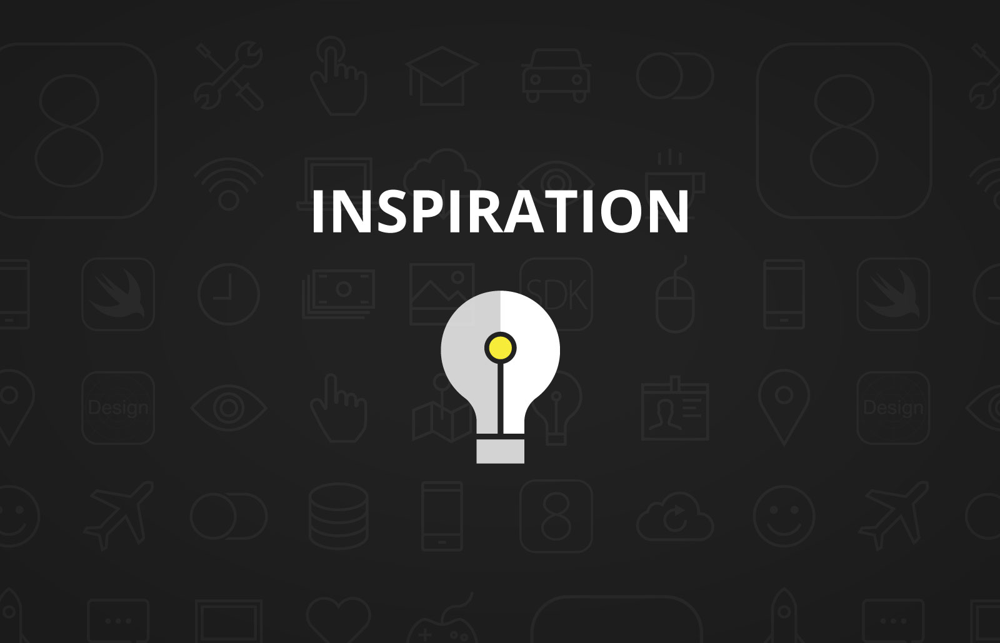
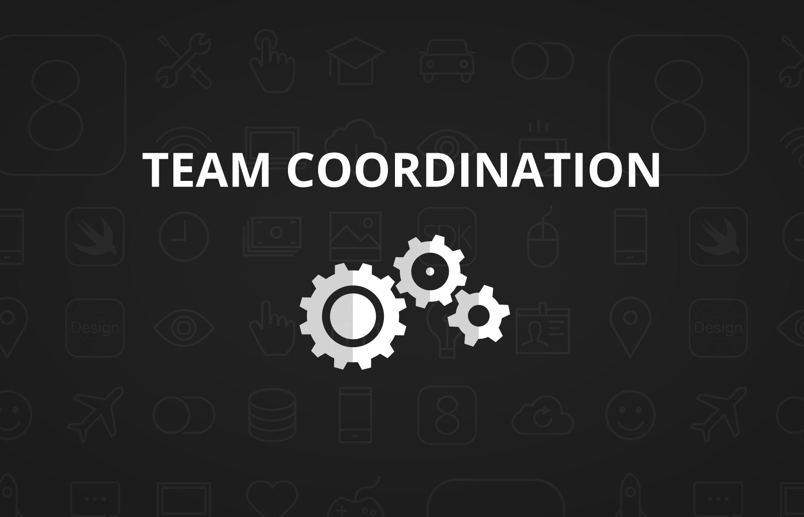
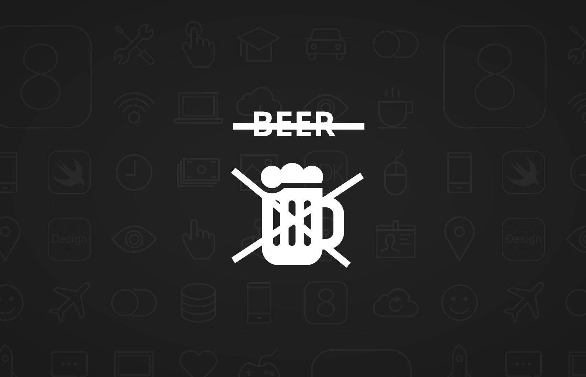
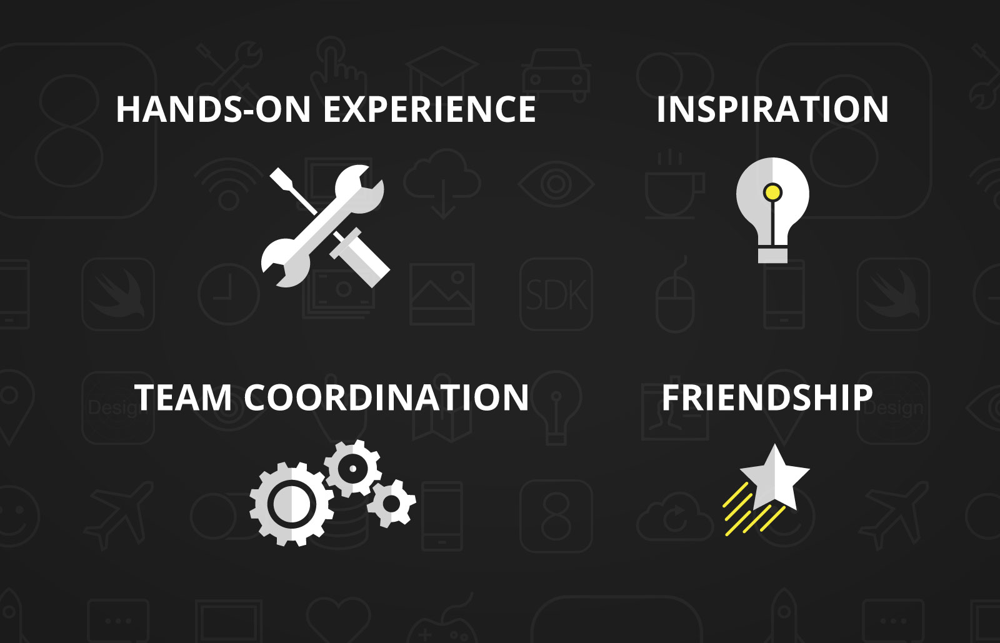
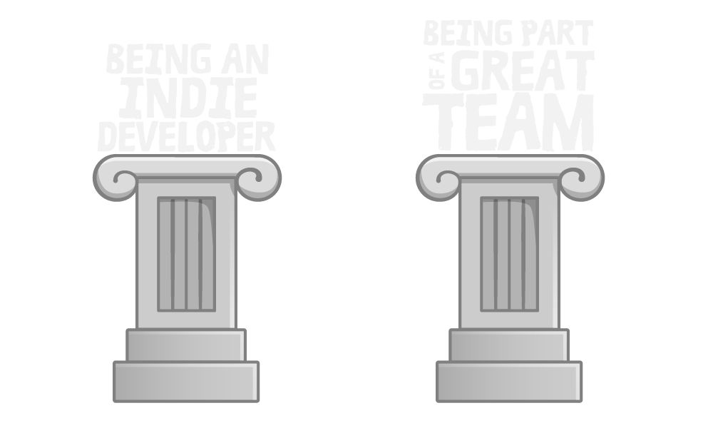
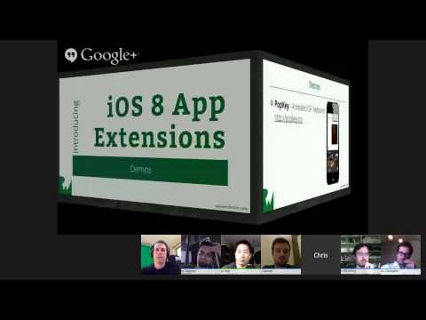
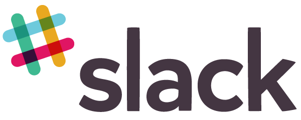
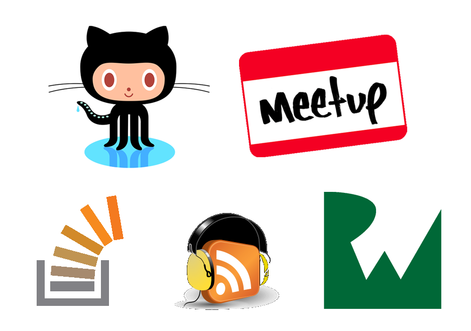

^ Good morning everybody, and welcome to RWDevCon! 

^ My name is Vicki Wenderlich, and as you might know, I'm Ray's wife. I work with Ray on everything we do at raywenderlich.com, and everything we do at our company, Razeware. For example, if you see any artwork in tutorials on the site, there's a good chance that I made it. I also have the honor of being your host this morning.

^ Ray, myself, and the rest of the RWDevCon team are super excited to be here with all of you today. We have 180 attendees from across the world - countries like Finland, Germany, Iceland, Serbia, and more - thank you all for coming, and making the sometimes very long journey. We're really excited that you're here, and we can't wait to talk to you and get to know you.

^ There's one thing you gotta know about RWDevCon: this is not a normal developer conference.

^ At a normal developer conference, you go into a room, somebody shows you some slides and maybe a demo, and you write down some notes, sure you're learning something. But if you're anything like us, when you actually go to use the material on your own, you realize you haven't actually learned anything except a high level overview, and you have to learn it all over again.

^ We thought there had to be a better way, and so the idea of RWDevCon was born.

---

^ RWDevCon is focused around 4 main ideas: hands-on experience

---

^ inspiration

---

^ team coordination, and 

---

^ beer. 

---

^ No just kidding, the fourth idea is 

---

^ friendship, but beer is #5.

---

^ First, there's hands-on experience. Most of each day you'll be working on high-quality hands-on tutorials. Each tutorial will be split into 5 parts.

^First, the speaker will start with a 5 minute introduction to the topic. 

^Second, you'll jump straight into a demo - but instead of just watching the speaker, you will follow along with him or her, coding the exact same project they're working on. 

^Third, you'll switch to a lab, which is a hands-on guided step-by-step exercise, just like the written tutorials you know and love from raywenderlich.com.  

^Fourth, you'll wrap up with a challenge, which asks you to use you've what you've learned to extend your project a little bit more, and get some real practice with what you've learned.

^Finally, the speaker will return with a brief conclusion that wraps up the concepts you covered.

^Our hope is by going through these stages - of practicing the material with the instructor, then on your own with a guide, and finally completely on your own, you will really learn the material and walk away with new skills.

---

^ The second idea behind RWDevCon is inspiration. Now you guys and gals are going to be working hard all day on these hands-on tutorials, and there isn't a lot of room for breaks. So by the time the afternoon comes along, I'm willing to bet that most you will be pretty tired and ready to sit back and relax a bit.

^ So in the afternoon, we're going to switch things over to what we call "inspiration talks." These are short 18-minute talks on topics designed to share some battle-won advice, or challenge you to try something new or embark on a new path you might not have thought about otherwise. We hope that these talks bring you some new ideas and generate some good discussions between you and people you meet at the conference.

---

^ The third idea behind RWDevCon is team coordination. Everything about RWDevCon has been carefully coordinated and planned out as a team. We chose the topics as a team based on a survey we sent out to all you. We developed a great format for our conference tutorials and designed our sessions around that format. Plus we practiced our tutorials with each other as a sort of test drive, so we know the format works. You’re gonna love them.

---

^ The fourth idea behind RWDevCon is friendship. To us, the most important thing about going to a conference is the people you meet. We want to do all we can to encourage you to get out of your shell and meet other people while you're here. I know we're developers, and lot of times we're shy and find it hard to approach new people. But we ask, just for this conference, push yourself out of your comfort zone a little bit. If you see someone standing nearby, just walk up and introduce yourself. Ask them what they thought of the last talk, or what projects they're currently working on, and be open to when other people come up and introduce themselves to you. You never know, you might find a business partner or a lifelong friend. 

^ One the things we are known for in the iOS community, especially the raywenderlich.com community, is our spirit of friendliness and inclusiveness - so let's do all we can to make everyone feel comfortable, welcome, and part of the same team. We're counting on all of you for this, and we ourselves look forward to making lasting friendships with all of you.

---

^ These are the four main ideas behind RWDevCon: hands-on experience, inspiration, team coordination, and friendship. 

^And with that, please help me welcome my husband Ray, our keynote speaker. He’s here to talk about a subject very near and dear to his heart, and the reason we're all here today: Teamwork.

---

# [Fit] Teamwork

——-

^ People who were born before 1960 or so commonly ask each other “Where Were You When Apollo 11 Landed On the Moon?” But for us as iOS developers, we have a different question:

---

^ “Where were you when you got your first iPhone?” I vividly remember when I first got mine - it was a magical experience, and I'm sure it was the same for many of you. Once we realized we could make apps for this that we carry around in our pockets, show off to our friends, and have anyone across the world download on the App Store, we were hooked. 

---

# 2009

^ For many of us, this took place somewhere around 2009. At that time, apps looked like this...

---

^ ...and code looked like this.

---

^ ...

---

^ We were in the middle of the great App Store gold rush. Believe it or not, the guy who made...

---

^ ...this fart app made millions, and we all wanted to be just like him. It seemed like everybody had the next great app idea. 

---

# Feeling of
# [Fit]**Excitement**
# in the air

^ There was this feeling of excitement in the air that inspired many of us to become full-time iOS developers. One the first books on iPhone development, “Beginning iPhone Development” by Dave Mark and Jeff LaMarche, summed up this feeling of excitement in the air really well in its preface. It said:

---

> The world is just beginning to open up.
-- Jeff LaMarche & Dave Mark

^ “I haven’t been this excited about a programming platform since I first set eyes on the Mac. . .The world is just beginning to open up.”

---

# [Fit] :heart:

^ Who here remembers that feeling when your first app was accepted into the App Store? Wasn’t that an incredible feeling of accomplishment? 

---

^ It addicting, and we so we just kept making apps. Our community of iOS developers continued to grow, and many of us became full-time indies making a living doing this.

---

# 2015

^ Fast-forward to 2015. There aren’t many indies left anymore. 

---

# The
# [Fit] Indiepocalypse

^ We call it “The Indiepocalypse”, and there’s been a lot of discussion about it in the last few months.

---

^ It all started when Jared Sinclair, a well known indie, released the sales numbers for his most recent app, which were well below expectations. Soon others started chiming in with their sales numbers, which were equally disappointing, and you started hearing about all these developers who had been silently leaving the scene over the years to get “real jobs”. This sense of doom and gloom came over the community. 

---

# Where'd all the indies go?

^ We started thinking - “What happened - where’d all the indies go”?

---

# from
# [Fit] Individuals
# to
# [Fit] Teams

^ What happened is as the App Store has matured over the years, developers started shifting from individuals to teams. And by nature, teams can accomplish a lot more than individuals - which makes it very hard for an individual to compete.

---

^ Logically, we know that in order to compete in this market, we’d be best served by making a team of our own. 

---

^ However emotionally, that’s easier said than done because we have these feelings and fears holding us back.

---

# Feelings

^ First, there’s feelings. As developers, many of us are introverts, and we like to work alone. We sometimes think - I can do it best. I want to do all the work so it’s right, I want things my way. I want all the credit, and I want all the rewards. Mine, mine, mine. Not very admirable, is it - but it’s true - we’ve all felt that way sometimes.

---

# Fears

^ Second, there’s fears. As developers, we’re sometimes scared to be part of a team. We’re afraid our teammates won’t work as hard as us, or they’ll mess up the project. We’re afraid of being a cog in a large machine.

^ I think these feelings and fears are counterproductive. If we let this negative thinking paralyze us...

---

# [Fit] We can miss out on a
# [Fit] great
# [Fit] opportunity.

^ We can miss out on a great opportunity. Consider for a moment the story of an indie iOS developer who almost missed out on the greatest opportunity of his life.

---

# [Fit] Quit job
# [Fit] Become indie
# [Fit] ???

^ In 2009 this developer decided to quit his job and become an indie iOS developer. He made his first app, fully expecting to be the next App Store millionaire.

---

^ Here's what the app looked like - I think I just heard Jony Ive cry. This just a very basic app with terrible graphics, and it sadly didn’t earn the guy a million dollars. But he had fun, and he learned a lot making it, so he kept going, and after about a year, he was lucky enough to be be earning what he needed to pay the bills.

---

# [Fit] Start blog
# [Fit] Need help
# [Fit] ???

^ While he was doing this, he also started a blog to write about some of the things he was learning along the way. The blog started to be a lot of work, and he realized that he needed some help to take things to the next level. But he was one of those darned introverts, and every time he'd start thinking about getting help, he'd say “Oh I should just do it myself so it’s done right”, or “Oh I’ll never be able to find anyone good”, “I can’t afford it” - or a myriad of other excuses. 

---

> Either get some help
> or shut down this blog.
-- -A smart wife 

^ Luckily this guy had a wife who was much smarter than him, who sat him down and said, “You need to either get some help, or shut down this blog.” So he found some great people to work with, and togehter they took the blog much further than he could have done all alone. But more importantly, he started thinking of himself no longer as an indie, but as a part of a great team.

---

^ As you might have guessed, this former indie iOS developer is me... (oh man I remember those $6 fondly, that was all the money I earned in 2009)...

—

^ ...and this great team is the raywenderlich.com team, and this former indie iOS developer is me. Being part of this great team has changed my life in ways I never would have imagined, and given me huge benefits over what I could have ever gotten as an individual. Let me share with just three of the benefits you can get by being a part of a great team.

---

# [Fit] 1
# Camaraderie and fun

^ First, being on a great team gives us this amazing sense of camaraderie and fun. When we’re part of a great team, we get to hang out with our teammates, talk about geeky news, share things we’re working on...

---

^ ...Photoshop each other’s faces on pictures, and so on. It really makes us feel connected, appreciated, and part of a tight knit group.

---

# [Fit] 2
# Reputation

^ Second, just like you have your own personal reputation, teams have reputations too, and by being a part of a great team, you can benefit from that reputation. On a great team, you have a reputation for something, whether it’s making great apps, great open sources software, great tutorials, etc. We hold each other to these high quality standards by giving each other constructive feedback on our work. We recognize what we did right and what we can improve upon next time, so we can improve both our personal and our team reputations.

---

# [Fit] 3

^ Third and most important to me...

---

# [Fit] **Teamwork lets you dream**
# [Fit] Bigger

^ Teamwork lets you dream bigger. As individuals, we thought in terms of building apps. As teams, we think in therms of building businesses. As individuals, we thought in terms of running meetups. As a team, we think in terms of running conferences. By working as a team, we’ve expanded the scope of what’s possible. Teamwork lets you dream bigger.

---

# What does this mean to you?

^ What does this mean to you, right now? 

---

# :smile:

^ First, I bet there’s a few indie developers, or independent contractors in the room. Can any indies here please raise your hands? First of all, congrats on being able to pull this off on your own - as we’ve discussed today, it’s not easy, and not everyone can do it. But just because you can do it alone, doesn’t mean you should. I encourage you to consider teaming up with somebody else on a future project of yours, somebody who is just as passionate about what you're working on, and brings just as many skills to the table. Who knows what you might be able to accomplish togehter.

---

# :smile: :smile: :smile: 

^ I know most of you are already on a team. Well there’s two cases right - you’re either happy with your team, or you’re not. Let’s discuss both cases. 

^ If you’re happy with your team, and you’re already enjoying these benefits - then I encourage you just take a moment and appreciate what you have. 

---

^ I want us to not just put indies on a pedestal as the benchmark for success...

---

^ ...but also put being a part of a great team up there as well, because it’s equally as challenging and important, and you get just as many benefits, if not more. Take a moment and appreciate the great things you’re accomplishing by working together a team, and the difference you are making in people's lives.

---

# :angry: :worried: :sob:

^ If you’re not so happy with your team, I encourage you to think “How can you help make your team into what it can be, and what it should be? How can you build that sense of belongingness? How can you improve your team’s reputation? How can you begin to dream bigger?” 

---

# [Fit]:angry: :worried: :sob:

^ "But wait a minute!" some of you are thinking. "My team is a mess, and there's nothing I can do. My boss is terrible, our clients are clueless, and the coder in the cubicle next to me only knows Fortran!" Even in this case I'd argue that there's still something you can do. Here are a few ideas off the top of my head.

---

^ You can make a team style guide.

---

^ You can start a system of code reviews.

---

^ You can do something silly, like having nerf gun wars, or making geeky song lyrics together.

---

^ You can share your knowledge.

---

^ You can start a team chat channel.

---

^ You can play board games at lunch.

---

# [Fit] :heart:

^ You can make a point to compliment your team members when they do something good.

---

# :ear: :smile:

^ You can listen to your team - they often have the best ideas.

---

# The power of 
# [Fit] iteration

^ Just pick one of these, or any of your own ideas. Make one small improvment, and keep iterating - each time, your team will level up. 

---

# [Fit] We have the power
# [Fit] to transform our teams into
# [Fit] something incredible

^ You have the power to transform your team into something incredible - take advantage of it.

---

# One More Team

^ Aside from our day jobs, there’s one more team all of us are a part of...

---

# [Fit] The iOS
# [Fit] Community

^ ...the iOS community. As iOS developers, we are incredibly lucky - because we have the best community of developers that has ever existed. Can I get a round of applause for the iOS community?

^ We have a reputation for being open, inclusive, sharing of our hard-won knowledge, and incredibly supportive to each other.

---

^ Some of you contribute to open source projects, some of you join your local meetup groups, some answer questions on StackOverflow or forums, some of you run podcasts, and some of you write tutorials or articles on our site or others. Some of you are beginners and aren’t doing this yet, but don’t worry - you will. Right now focus on learning - you will naturally find yourself contributing back later as you expand your skills.

---

# 2009

^ Back in 2009 when I was an indie iPhone developer, I never would have imagined...

---

^ that I’d be here with this amazing team of all you today, making this conference happen...

---

# [Fit] If I had continued on the road I was walking alone
# [Fit] I would have missed it all.

^ ...and if I had continued on the road I was walking alone, I would have missed it all.

---

^ Don’t fall into the trap I almost did, of being left alone with your feelings and fears. 

---

# :smile: :smile: :smile: 

^ Instead, I encourage you to think: What are the teams you can build, or the teams you can join, what are the great things you can create, and how can you change your life and the lives of others.

---

# [Fit] We’ll feel the world begin
# [Fit] to open up.

^ When you start doing this and making your wildest dreams a reality, just like in the preface of this programming book, you’ll feel the world begin to open up.

---

# 2015

^ It’s 2015...

---

# Feeling of
# [Fit]**Excitement**
# in the air

^  ...and to me there’s still a feeling of excitement in the air, more than ever...

---

# [Fit] A spirit of
# [Fit] friendship
# & 
# [Fit] cooperation

^ ...because with a spirit of friendship and cooperation, we can do anything.

^ Thank you.

---

^If we can do anything, I’m going to dream about a time when Ray and I can go out on a date and NOT talk about RWDevCon or the business! That might take some more teamwork.

^Before we dive into the tutorials, I have some logistics that I'd like to go over with you,  then we're going to play a fun little game involving this stuffed trout, and finally we'll end with a word about our sponsors. 

^First, the logistics.

---

^First, the logistics. You can find the schedule and details about each talk and every speaker in our official RWDevCon app, which you can download on the App Store and use to create your own personal schedule. You'll also find an abbreviated version of the schedule in the back of your conference badges for easy reference, and there are signs outside each room that will show the next talk for that room.

---

^You'll note that the conference has three tracks: beginner, intermediate, and advanced. Feel free to switch between the tracks as much as you'd like within the conference. Keep in mind that a few tutorials have prerequisite tutorials - you can either go to the prerequisite tutorials here, or if you already have equivalent knowledge, that's OK too.

^There are three rooms we'll have sessions in. First, there's this room, which is called the Metropolitan Center, which is where the advanced track will be. Second, down the hall, there's two rooms combined - The Grid and The Hub, which will be where the intermediate track will be. Third, even further down there's a final room called the Hill, which is where the beginner track will be. 

---

^ Lunch will be in both The Hill and here in the Metropolitan Center. We put out a survey a few weeks back asking for food special needs - if you are the one guy or gal who ordered a kosher meal, please come to the registration desk immediately after this talk because you are a special case - other than that there should be options for everyone in the buffet.

---

^ On Monday we sent out a zip file with the conference materials in a newsletter - you can also find a link on rwdevcon.com. If you do not have this yet, please download it now, or you can get a USB stick with the materials from the host in each tutorial room.

---

^A common question we get is "are the talks going to be recorded." The answer is yes for inspiration talks - we think those will translate great to video, so we'll post them for free up on the website. But we will not be recording the conference tutorials. This is because they've really been designed for a hands-on in-person experience, and would not translate well to videos. We feel that if we make a video, we want to do it right - and we usually would take a different approach than we do with the conference tutorials. So you'll see some of the same ideas from this conference in the video tutorial section on our site, but probably done a slightly different way that fits better with that format.

^OK - time to talk about some fun stuff.

---

^First, who here likes board games? We do too, especially Razeware's employee #1, Brian Moakley. Brian, can you please come up here for a moment?

^Brian has organized a really fun board game tournament that you are all invited to. We'll be playing a little game called "For Sale" 

---

^that is about buying and selling real estate, and also about trying to guess what other people are thinking. If this sounds like fun, stop by The Grid/Hub at lunchtime. You can learn the rules and practice before the tournament begins.

^We have some great prizes for the winners - the grand prize winner gets a $50 iTunes card, a free PDF and print book of their choice from raywenderlich.com, and a free copy of the game, "For Sale". There are also prizes for runners up.

^So again - if this sounds like fun, stop by The Grid/Hub at lunchtime today and look for Brian. Note we are limited by space, so if you don't get a slot in the tournament please just bear with us. Thanks Brian!

---

^Second, who likes free food and beer? We figured you might, and so we've set up an awesome party for you all tonight at a place right down the street called Penn Social. We have an area reserved for us and own private bar. Just go downstairs, look for the RWDevCon banner. and be sure to bring your badge - you'll need that in order for us to give you a wristband to get in the area. We'll have a spread of all kinds of good food, and a bar for drinks. You can order beer, wine, rail drinks, and sodas, and they'll be free until our bar tab runs out. We should have enough to cover about 2 drinks per person - basically feel free to keep ordering until the bartender tells you that the tab is done - and then you can get more if you want, but you’d pay for your own after that. 

---

^The cool thing about Penn Social is there's various kinds of games there like board games, shuffleboard, skeeball, and more - so if you wanna sit around and eat, drink and chat that's great, and if you want to play games you can do that too. 

^One thing to note - Penn Social is a bar, so you do have to be 21 years of age or over to attend.

^Penn Social is just a short walk from the hotel - we’ll be giving out maps in the lobby at the end of the day. Be sure to dress warm when you leave the hotel because it is chilly out, and you might want to bring an umbrella if it looks like it might rain.

---

^Third, who likes fame and fortune? We do too, especially our official conference photographer and videographer, Christine Sweigart. Christine, can you come up here for a moment?

^Take a good look at this person. Christine will be going around the conference taking photos of everybody learning and having fun. She'll also be making a conference video, so if anybody has anything they'd like say about what you thought about the conference or any funny or interesting stories of what happened here, please find Christine. We'd like to get as many of you as possible into the video. Thanks Christine!

^Okay! That was a lot of logistics!

---

^Now we're gonna switch gears to that fun little game I was talking about, involving this stuffed trout.

^For this game, I'm going to need two "volunteers" - and I pick Chris Wagner and Charlie Fulton. Chris and Charlie, come on up!

---

^This game is called "Dos and Dont's at RWDevCon." In this game, Chris will take the role of the speaker, and Charlie will take role of an attendee. Each time I list a do or don't, Charlie will act it out. If Charlie does a DO, Chris will give him a thumbs up. If Charlie does a DON'T, Chris will slap charlie with this stuffed trout.

^Allright let's dive in!

---

# [Fit] DO 
# work hard

^First, DO work hard. [Charlie: pretend to be typing on laptop furiously. Charis: give Charlie the thumbs-up]. What you'll get out of this conference is what you'll put into it. These tutorials are intense. You'll be coding non-stop for an hour and 15 minutes at a time. So you gotta be prepared to work hard and try your best to finish the labs and challenges; if you do, you will get some great benefits.

---

# [Fit] DON’T 
# slack off

^Second, DON'T slack off. [Charlie: pretend to be sleeping. Chris: slap Charlie with a trout.] If you're like us, you might be tempted to check your email during the lab or challenge portion of a tutorial, or check reddit real quick. The thing is, these tutorials have been designed to take up your full amount of time so if you waste your time doing other things, you're gonna get behind and not learn as much. So we recommend you stay focused on the tutorials, and save all that other stuff for after the conference.

---

# [Fit] DO 
#ask questions during 
#the demo

# IF THEY’RE BRIEF

^Third, DO ask questions during the demo if they're brief. [Charlie: raise hand. Chris: mimic brief answer, then thumbs up]. If you have a question when the speaker is going through their demo, just yell it out - if it's something brief that you think can be answered in a minute or so. Chances are somebody else will have the same question and we built in a little time in the schedule for this kind of thing.

---

# [Fit] DON’T 
#ask questions during 
#the demo
#IF THEY’RE LONG

^Fourth, DON'T ask questions during the demo if they're long and particular to you. [Charlie: raise hand. Chris: scratch head, go look at Charlie's computer, scratch head, then slap him with a trout]. Remember you will be following along with the speaker during the demo portion. We expect most of you will be able to follow along OK with the speaker if you have the required prerequisite knowledge. But - you know things go wrong sometimes. There is chance you might make a mistake following along with the speaker somewhere and get hopelessly lost. If you're at the point where things aren't working for you but they are for most other people, we're gonna have to keep moving because we're on a tight time schedule. You’ll get help after the demo, don’t worry. Just pay attention the best you can, and try to follow along. 

---

# [Fit] DO 
#tweet about the conference
# #rwdevcon

^Fifth, DO tweet about the conference. [Charlie: Whistle like a bird. Chris: Give thumbs up]. This helps us with our goal of friendship - we want to see what each other are thinking about the conference, share some jokes, and get to know each other on Twitter. Plus, since this is our first time running the conference, we’d love it if you guys help us spread the word and make everybody who's not here feel a little jealous. Please use the hash tag #rwdevcon. 

---

# [Fit] DON’T 
# harass others

^Sixth, DON'T harass others - verbally or otherwise. This is a serious subject, so no acting from Charlie and Chris on this one. Like we mentioned, we're an inclusive community that accepts everyone regardless of gender, sexual orientation, disability, race, or religion, so please act like it. We do not tolerate harassment of any sort, and we expect all attendees, sponsors, speakers, and organizers to act with respect for each other. If you feel harassed or uncomfortable at any point, please come to myself, Ray, or any of the speakers or organizers who you can identify by their black shirts.

---

# [Fit] DON’T 
# leave early

^Seventh, DON'T leave early. [Charlie: Try to sneak out of room. Chris: slap with trout.] We have a full two days of content ready for you. We think you're really going to like what we have prepared for you and we don't want you to miss out. Please respect and support the speakers who have spent countless hours preparing for this conference. Plus, we have a special announcement that you're really going to want to be there for in the closing remarks of the conference tomorrow, and if you miss it, well you miss it and don't cry to me later.

---

# [Fit] DON’T 
#be Charlie!

^The eighth and final DON'T, is DON'T be Charlie Fulton, or else you might get slapped by a trout. [Chris: Slap Charlie with trout. Charlie: Act all shocked, yuk it up a bit.] Thanks so much to Chris and Charlie for playing along with our little game, please help me give them a round of applause.

---

# Sponsors

^It's almost time to dive into the tutorials, but first I'd like to thank the sponsors who helped this conference happen. They are the reason why we're able to do some of the cooler stuff like the party tonight. 

---

^First, there's Facebook and Parse. It is a true honor to be be sponsored by them; we are so impressed by the amazing work Facebook has done in the app and open source community lately, and Parse has made making back-ends for our apps so much cheaper and easier than doing it on our own. In fact we are lucky to have Scott Goodson, the Engineering Manager of Facebook Paper, here with us today, as well as Fosco Marotto from Parse. We also have two Tutorial Team members who work at Facebook here with us today: Matt Galloway and Ryan Nystrom.

---

^Second, there's savvy apps. savvy apps is a mobile development company headquartered here in DC. Ray and I have met the CEO, Ken Yarmosh, many times at various iOS conferences, and he's a great guy and we're really excited he and his company could join us today. If any of you are potentially interested in an iOS gig - whether full-time or part-time - definitely stop by savvy app's table, they're currently recruiting. Note that they're open to remote developers, and they're particularly interested in you guys because you've proven yourselves to be interested and passionate about keeping your iOS skills up-to-date.

---

^Those are our gold sponsors, so I wanted to call them out in particular here. But we have a number of others sponsors that we couldn't have done this without: Shinobi Controls, Lextech, Crittercism, Countly, and AppCode, so be sure to stop their tables, check out the info they included in your loot bags, because they are the companies that are making an effort to give back to the iOS community.

^Let's give a round of applause to all of our sponsors.

---

# One last thing…

^One last thing. To thank all of you, the attendees, we wanted to share with you guys something special we’ve been working on. Please help me welcome Marin Todorov to the front of the room, for an RWDevCon exclusive announcement.

^Thanks Marin! Be sure to stop by the registration desk to check out the book.

---

^OK - well those are all the announcements I have for right now. Now I get to turn you loose to the hands-on tutorials! 

^Get ready to work hard, learn tons, get inspired, and make friends. Remember, that we are all in this together as a team...

---

# [Fit] A spirit of
# [Fit] friendship
# & 
# [Fit] cooperation

^ ... and with a spirit of friendship and cooperation...

---

^ ...let's make this a conference to remember.

^Thank you!

