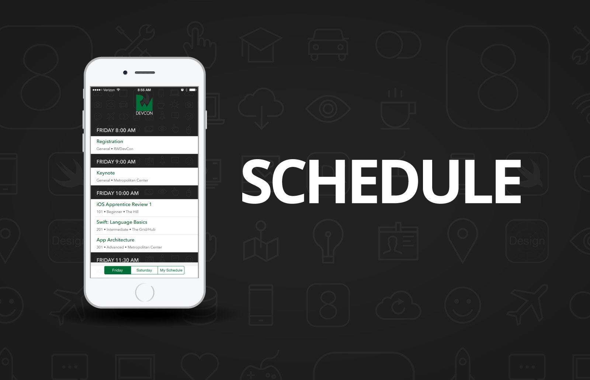
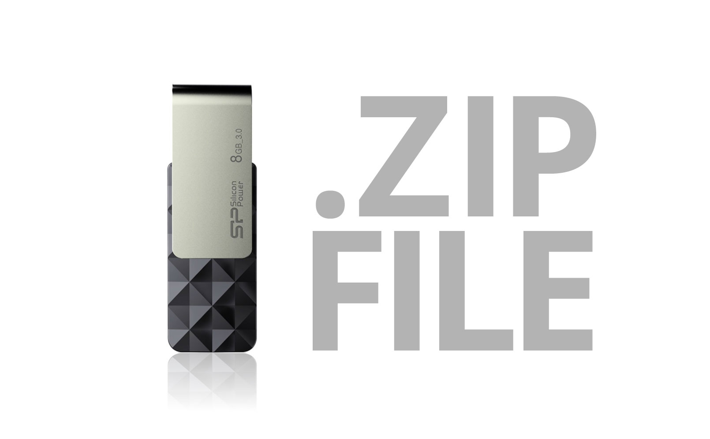
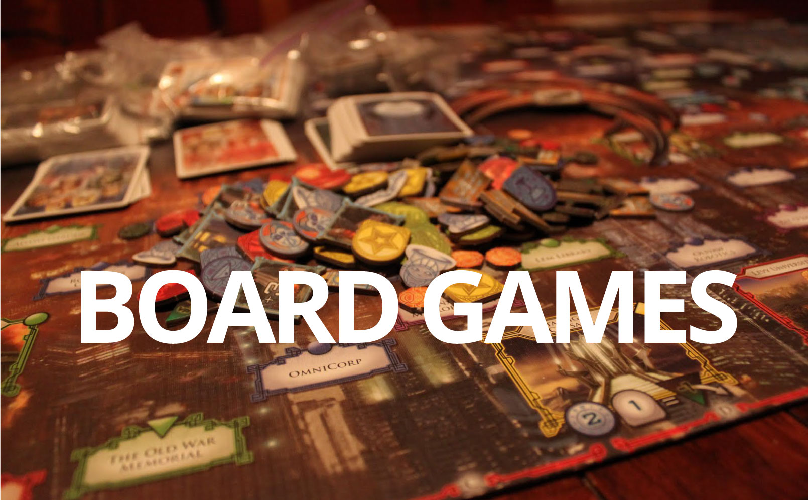
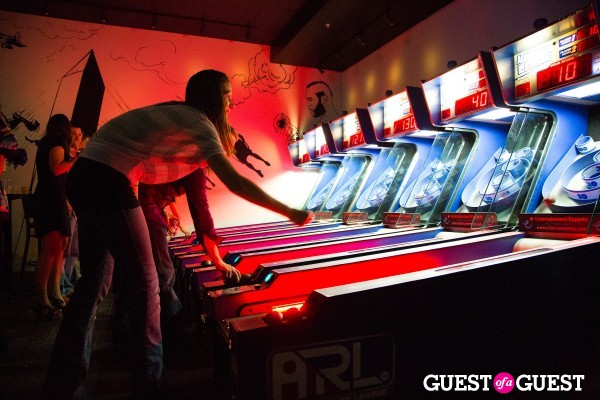
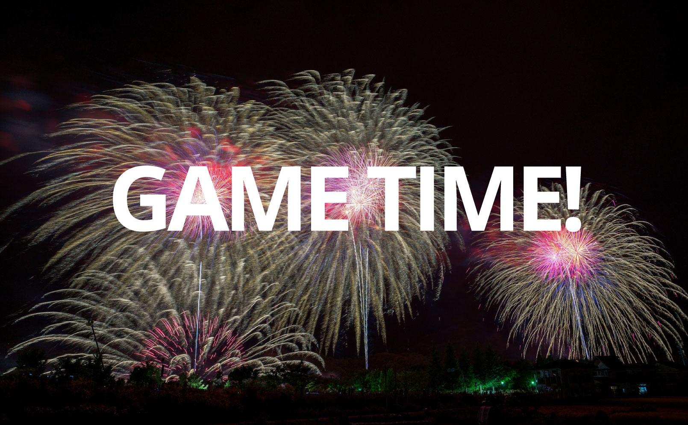
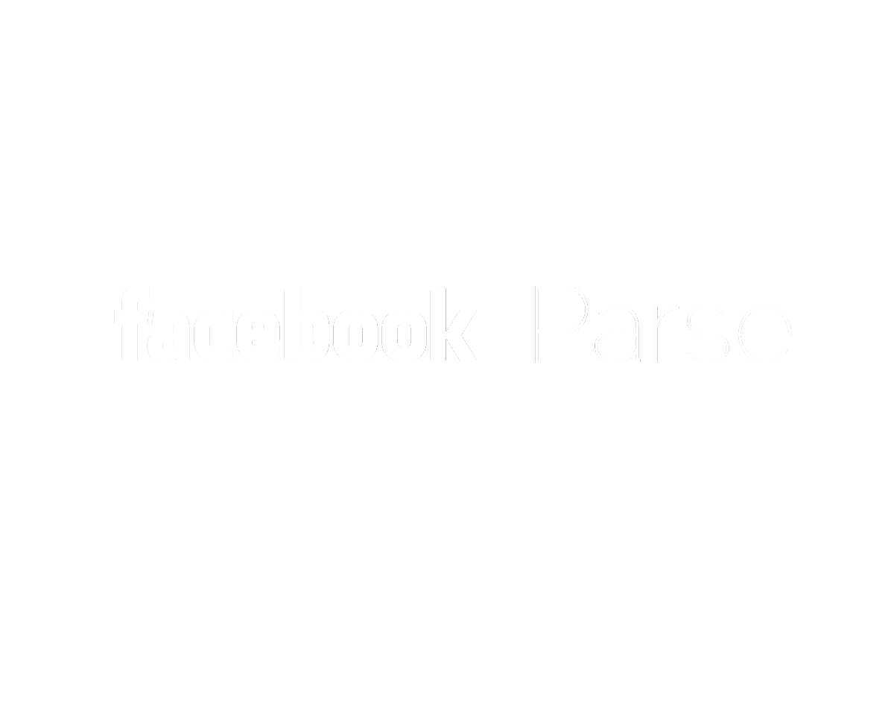

^If we can do anything, I’m going to dream about a time when Ray and I can go out on a date and NOT talk about RWDevCon or the business! That might take some more teamwork.

^Before we dive into the tutorials, I have some logistics that I'd like to go over with you,  then we're going to play a fun little game involving this stuffed trout, and finally we'll end with a word about our sponsors. 

^First, the logistics.

---

^First, the logistics. You can find the schedule and details about each talk and every speaker in our official RWDevCon app, which you can download on the App Store and use to create your own personal schedule. You'll also find an abbreviated version of the schedule in the back of your conference badges for easy reference, and there are signs outside each room that will show the next talk for that room.

---

^You'll note that the conference has three tracks: beginner, intermediate, and advanced. Feel free to switch between the tracks as much as you'd like within the conference. Keep in mind that a few tutorials have prerequisite tutorials - you can either go to the prerequisite tutorials here, or if you already have equivalent knowledge, that's OK too.

^There are three rooms we'll have sessions in. First, there's this room, which is called the Metropolitan Center, which is where the advanced track will be. Second, down the hall, there's two rooms combined - The Grid and The Hub, which will be where the intermediate track will be. Third, even further down there's a final room called the Hill, which is where the beginner track will be. 

---

^ Lunch will be in both The Hill and here in the Metropolitan Center. We put out a survey a few weeks back asking for food special needs - if you are the one guy or gal who ordered a kosher meal, please come to the registration desk immediately after this talk because you are a special case - other than that there should be options for everyone in the buffet.

---

^ On Monday we sent out a zip file with the conference materials in a newsletter - you can also find a link on rwdevcon.com. If you do not have this yet, please download it now, or you can get a USB stick with the materials from the host in each tutorial room.

---

^A common question we get is "are the talks going to be recorded." The answer is yes for inspiration talks - we think those will translate great to video, so we'll post them for free up on the website. But we will not be recording the conference tutorials. This is because they've really been designed for a hands-on in-person experience, and would not translate well to videos. We feel that if we make a video, we want to do it right - and we usually would take a different approach than we do with the conference tutorials. So you'll see some of the same ideas from this conference in the video tutorial section on our site, but probably done a slightly different way that fits better with that format.

^OK - time to talk about some fun stuff.

---

^First, who here likes board games? We do too, especially Razeware's employee #1, Brian Moakley. Brian, can you please come up here for a moment?

^Brian has organized a really fun board game tournament that you are all invited to. We'll be playing a little game called "For Sale" 

---

^that is about buying and selling real estate, and also about trying to guess what other people are thinking. If this sounds like fun, stop by The Grid/Hub at lunchtime. You can learn the rules and practice before the tournament begins.

^We have some great prizes for the winners - the grand prize winner gets a $50 iTunes card, a free PDF and print book of their choice from raywenderlich.com, and a free copy of the game, "For Sale". There are also prizes for runners up.

^So again - if this sounds like fun, stop by The Grid/Hub at lunchtime today and look for Brian. Note we are limited by space, so if you don't get a slot in the tournament please just bear with us. Thanks Brian!

---

^Second, who likes free food and beer? We figured you might, and so we've set up an awesome party for you all tonight at a place right down the street called Penn Social. We have an area reserved for us and own private bar. Just go downstairs, look for the RWDevCon banner. and be sure to bring your badge - you'll need that in order for us to give you a wristband to get in the area. We'll have a spread of all kinds of good food, and a bar for drinks. You can order beer, wine, rail drinks, and sodas, and they'll be free until our bar tab runs out. We should have enough to cover about 2 drinks per person - basically feel free to keep ordering until the bartender tells you that the tab is done - and then you can get more if you want, but you’d pay for your own after that. 

---

^The cool thing about Penn Social is there's various kinds of games there like board games, shuffleboard, skeeball, and more - so if you wanna sit around and eat, drink and chat that's great, and if you want to play games you can do that too. 

^One thing to note - Penn Social is a bar, so you do have to be 21 years of age or over to attend.

^Penn Social is just a short walk from the hotel - we’ll be giving out maps in the lobby at the end of the day. Be sure to dress warm when you leave the hotel because it is chilly out, and you might want to bring an umbrella if it looks like it might rain.

---

^Third, who likes fame and fortune? We do too, especially our official conference photographer and videographer, Christine Sweigart. Christine, can you come up here for a moment?

^Take a good look at this person. Christine will be going around the conference taking photos of everybody learning and having fun. She'll also be making a conference video, so if anybody has anything they'd like say about what you thought about the conference or any funny or interesting stories of what happened here, please find Christine. We'd like to get as many of you as possible into the video. Thanks Christine!

^Okay! That was a lot of logistics!

---

^Now we're gonna switch gears to that fun little game I was talking about, involving this stuffed trout.

^For this game, I'm going to need two "volunteers" - and I pick Chris Wagner and Charlie Fulton. Chris and Charlie, come on up!

---

^This game is called "Dos and Dont's at RWDevCon." In this game, Chris will take the role of the speaker, and Charlie will take role of an attendee. Each time I list a do or don't, Charlie will act it out. If Charlie does a DO, Chris will give him a thumbs up. If Charlie does a DON'T, Chris will slap charlie with this stuffed trout.

^Allright let's dive in!

---

# [Fit] DO 
# work hard

^First, DO work hard. [Charlie: pretend to be typing on laptop furiously. Charis: give Charlie the thumbs-up]. What you'll get out of this conference is what you'll put into it. These tutorials are intense. You'll be coding non-stop for an hour and 15 minutes at a time. So you gotta be prepared to work hard and try your best to finish the labs and challenges; if you do, you will get some great benefits.

---

# [Fit] DON’T 
# slack off

^Second, DON'T slack off. [Charlie: pretend to be sleeping. Chris: slap Charlie with a trout.] If you're like us, you might be tempted to check your email during the lab or challenge portion of a tutorial, or check reddit real quick. The thing is, these tutorials have been designed to take up your full amount of time so if you waste your time doing other things, you're gonna get behind and not learn as much. So we recommend you stay focused on the tutorials, and save all that other stuff for after the conference.

---

# [Fit] DO 
#ask questions during 
#the demo

# IF THEY’RE BRIEF

^Third, DO ask questions during the demo if they're brief. [Charlie: raise hand. Chris: mimic brief answer, then thumbs up]. If you have a question when the speaker is going through their demo, just yell it out - if it's something brief that you think can be answered in a minute or so. Chances are somebody else will have the same question and we built in a little time in the schedule for this kind of thing.

---

# [Fit] DON’T 
#ask questions during 
#the demo
#IF THEY’RE LONG

^Fourth, DON'T ask questions during the demo if they're long and particular to you. [Charlie: raise hand. Chris: scratch head, go look at Charlie's computer, scratch head, then slap him with a trout]. Remember you will be following along with the speaker during the demo portion. We expect most of you will be able to follow along OK with the speaker if you have the required prerequisite knowledge. But - you know things go wrong sometimes. There is chance you might make a mistake following along with the speaker somewhere and get hopelessly lost. If you're at the point where things aren't working for you but they are for most other people, we're gonna have to keep moving because we're on a tight time schedule. You’ll get help after the demo, don’t worry. Just pay attention the best you can, and try to follow along. 

---

# [Fit] DO 
#tweet about the conference
# #rwdevcon

^Fifth, DO tweet about the conference. [Charlie: Whistle like a bird. Chris: Give thumbs up]. This helps us with our goal of friendship - we want to see what each other are thinking about the conference, share some jokes, and get to know each other on Twitter. Plus, since this is our first time running the conference, we’d love it if you guys help us spread the word and make everybody who's not here feel a little jealous. Please use the hash tag #rwdevcon. 

---

# [Fit] DON’T 
# harass others

^Sixth, DON'T harass others - verbally or otherwise. This is a serious subject, so no acting from Charlie and Chris on this one. Like we mentioned, we're an inclusive community that accepts everyone regardless of gender, sexual orientation, disability, race, or religion, so please act like it. We do not tolerate harassment of any sort, and we expect all attendees, sponsors, speakers, and organizers to act with respect for each other. If you feel harassed or uncomfortable at any point, please come to myself, Ray, or any of the speakers or organizers who you can identify by their black shirts.

---

# [Fit] DON’T 
# leave early

^Seventh, DON'T leave early. [Charlie: Try to sneak out of room. Chris: slap with trout.] We have a full two days of content ready for you. We think you're really going to like what we have prepared for you and we don't want you to miss out. Please respect and support the speakers who have spent countless hours preparing for this conference. Plus, we have a special announcement that you're really going to want to be there for in the closing remarks of the conference tomorrow, and if you miss it, well you miss it and don't cry to me later.

---

# [Fit] DON’T 
#be Charlie!

^The eighth and final DON'T, is DON'T be Charlie Fulton, or else you might get slapped by a trout. [Chris: Slap Charlie with trout. Charlie: Act all shocked, yuk it up a bit.] Thanks so much to Chris and Charlie for playing along with our little game, please help me give them a round of applause.

---

# Sponsors

^It's almost time to dive into the tutorials, but first I'd like to thank the sponsors who helped this conference happen. They are the reason why we're able to do some of the cooler stuff like the party tonight. 

---

^First, there's Facebook and Parse. It is a true honor to be be sponsored by them; we are so impressed by the amazing work Facebook has done in the app and open source community lately, and Parse has made making back-ends for our apps so much cheaper and easier than doing it on our own. In fact we are lucky to have Scott Goodson, the Engineering Manager of Facebook Paper, here with us today, as well as Fosco Marotto from Parse. We also have two Tutorial Team members who work at Facebook here with us today: Matt Galloway and Ryan Nystrom.

---

^Second, there's savvy apps. savvy apps is a mobile development company headquartered here in DC. Ray and I have met the CEO, Ken Yarmosh, many times at various iOS conferences, and he's a great guy and we're really excited he and his company could join us today. If any of you are potentially interested in an iOS gig - whether full-time or part-time - definitely stop by savvy app's table, they're currently recruiting. Note that they're open to remote developers, and they're particularly interested in you guys because you've proven yourselves to be interested and passionate about keeping your iOS skills up-to-date.

---

^Those are our gold sponsors, so I wanted to call them out in particular here. But we have a number of others sponsors that we couldn't have done this without: Shinobi Controls, Lextech, Crittercism, Countly, and AppCode, so be sure to stop their tables, check out the info they included in your loot bags, because they are the companies that are making an effort to give back to the iOS community.

^Let's give a round of applause to all of our sponsors.

---

# One last thing…

^One last thing. To thank all of you, the attendees, we wanted to share with you guys something special we’ve been working on. Please help me welcome Marin Todorov to the front of the room, for an RWDevCon exclusive announcement.

^Thanks Marin! Be sure to stop by the registration desk to check out the book.

^OK - well those are all the announcements I have for right now. Now I get to turn you loose to the hands-on tutorials! 

^Get ready to work hard, learn tons, get inspired, and make friends. Remember, we are all in this together as a team, in a spirit of friendship and cooperation - so let's make this a conference to remember.

^Thank you!

