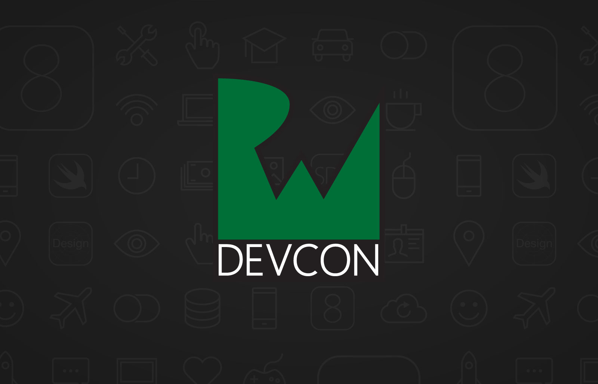
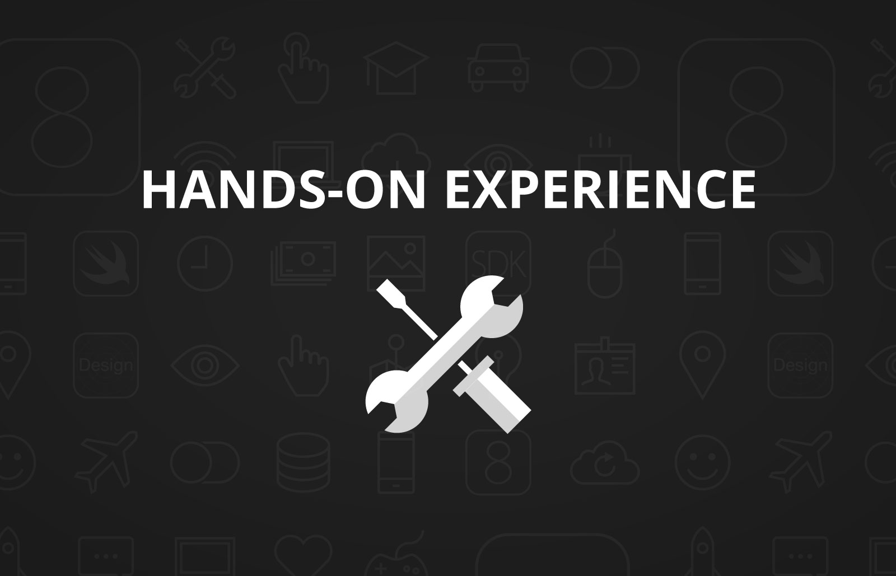
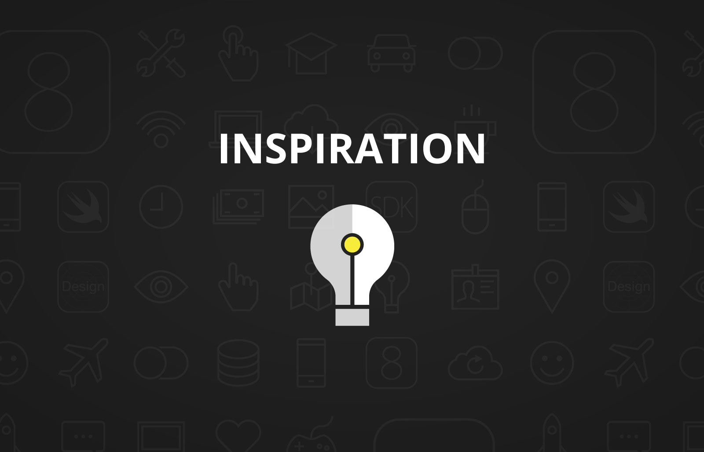
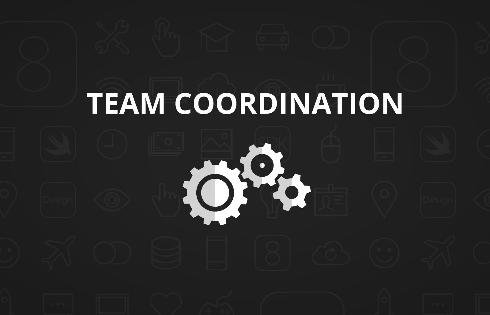
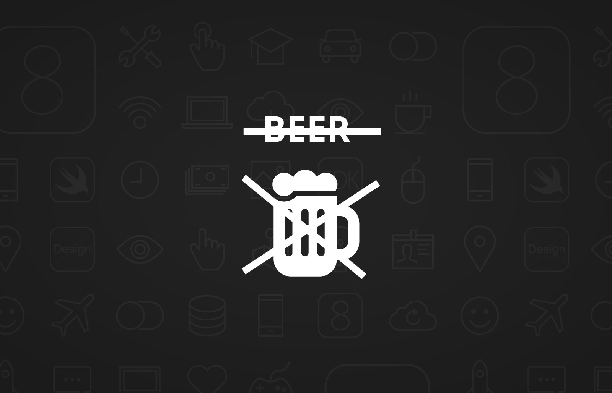
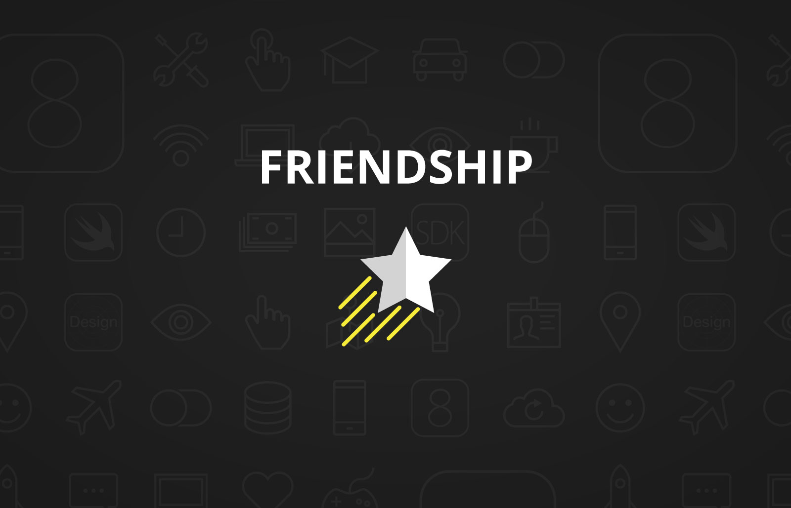
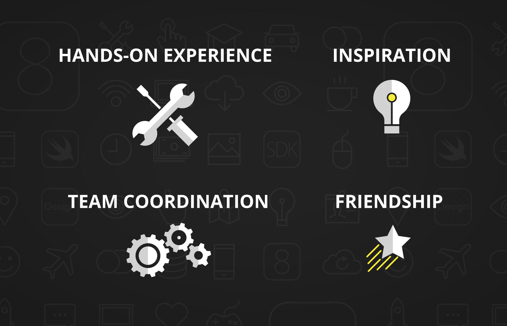

^ Good morning everybody, and welcome to RWDevCon! 

^ My name is Vicki Wenderlich, and as you might know, I'm Ray's wife. I work with Ray on everything we do at raywenderlich.com, and everything we do at our company, Razeware. For example, if you see any artwork in tutorials on the site, there's a good chance that I made it. I also have the honor of being your host this morning.

^ Ray, myself, and the rest of the RWDevCon team are super excited to be here with all of you today. We have 180 attendees from across the world - countries like Finland, Germany, Iceland, Serbia, and more - thank you all for coming, and making the sometimes very long journey. We're really excited that you're here, and we can't wait to talk to you and get to know you.

^ There's one thing you gotta know about RWDevCon: this is not a normal developer conference.

^ At a normal developer conference, you go into a room, somebody shows you some slides and maybe a demo, and you write down some notes, sure you're learning something. But if you're anything like us, when you actually go to use the material on your own, you realize you haven't actually learned anything except a high level overview, and you have to learn it all over again.

^ We thought there had to be a better way, and so the idea of RWDevCon was born.

---

^ RWDevCon is focused around 4 main ideas: hands-on experience

---

^ inspiration

---

^ team coordination, and 

---

^ beer. 

---

^ No just kidding, the fourth idea is 

---

^ friendship, but beer is #5.

---

^ First, there's hands-on experience. Most of each day you'll be working on high-quality hands-on tutorials. Each tutorial will be split into 5 parts.

^First, the speaker will start with a 5 minute introduction to the topic. 

^Second, you'll jump straight into a demo - but instead of just watching the speaker, you will follow along with him or her, coding the exact same project they're working on. 

^Third, you'll switch to a lab, which is a hands-on guided step-by-step exercise, just like the written tutorials you know and love from raywenderlich.com.  

^Fourth, you'll wrap up with a challenge, which asks you to use you've what you've learned to extend your project a little bit more, and get some real practice with what you've learned.

^Finally, the speaker will return with a brief conclusion that wraps up the concepts you covered.

^Our hope is by going through these stages - of practicing the material with the instructor, then on your own with a guide, and finally completely on your own, you will really learn the material and walk away with new skills.

---

^ The second idea behind RWDevCon is inspiration. Now you guys and gals are going to be working hard all day on these hands-on tutorials, and there isn't a lot of room for breaks. So by the time the afternoon comes along, I'm willing to bet that most you will be pretty tired and ready to sit back and relax a bit.

^ So in the afternoon, we're going to switch things over to what we call "inspiration talks." These are short 18-minute talks on topics designed to share some battle-won advice, or challenge you to try something new or embark on a new path you might not have thought about otherwise. We hope that these talks bring you some new ideas and generate some good discussions between you and people you meet at the conference.

---

^ The third idea behind RWDevCon is team coordination. Everything about RWDevCon has been carefully coordinated and planned out as a team. We chose the topics as a team based on a survey we sent out to all you. We developed a great format for our conference tutorials and designed our sessions around that format. Plus we practiced our tutorials with each other as a sort of test drive, so we know the format works. You’re gonna love them.

---

^ The fourth idea behind RWDevCon is friendship. To us, the most important thing about going to a conference is the people you meet. We want to do all we can to encourage you to get out of your shell and meet other people while you're here. I know we're developers, and lot of times we're shy and find it hard to approach new people. But we ask, just for this conference, push yourself out of your comfort zone a little bit. If you see someone standing nearby, just walk up and introduce yourself. Ask them what they thought of the last talk, or what projects they're currently working on, and be open to when other people come up and introduce themselves to you. You never know, you might find a business partner or a lifelong friend. 

^ One the things we are known for in the iOS community, especially the raywenderlich.com community, is our spirit of friendliness and inclusiveness - so let's do all we can to make everyone feel comfortable, welcome, and part of the same team. We're counting on all of you for this, and we ourselves look forward to making lasting friendships with all of you.

---

^ These are the four main ideas behind RWDevCon: hands-on experience, inspiration, team coordination, and friendship. As Ray likes to say, "you have no idea of the awesomeness that is about to be unleashed upon you."

^And with that, please help me welcome my husband Ray, our keynote speaker. He’s here to talk about a subject very near and dear to his heart, and the reason we're all here today: Teamwork.

