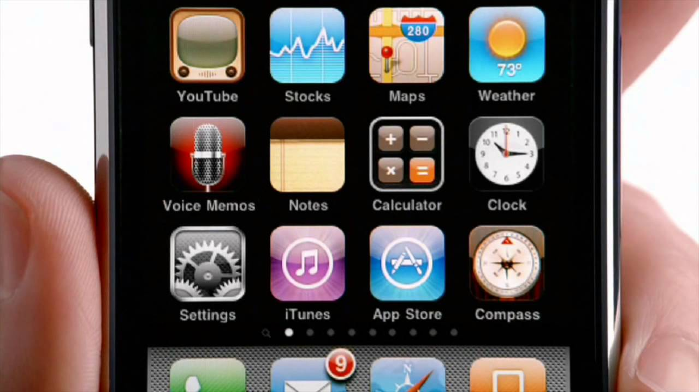

# [Fit] Teamwork

——

^ People who were born before 1960 or so commonly ask each other “Where Were You When Apollo 11 Landed On the Moon?” But for us as iOS developers, we have a different question:

---

^ “Where were you when you got your first iPhone?” [My example] This was a magical experience, and once we realized we could make apps for this that we carry around in our pockets, show off to our friends, and have anyone across the world download on the App Store, we were hooked - and we knew this is what we had to do. 

---

# 2009

^ For many of us, this took place somewhere around 2009.

---

^ At that time, we had just gotten the iPhone OS 3 SDK. At that time, apps looked like this...

---

^ ...and code looked like this.

---

^ ...

---

^ At that time, the App Store was 1 year old and we were in the middle of the gold rush. Believe it or not, the guy who made...

---

^ ...this fart app made millions, and we all wanted to be just like him. It seemed like everybody had the next great app idea. 

---

# Feeling of
# [Fit]**Excitement**
# in the air

^ There was this feeling of excitement in the air that inspired many of us to become full-time iOS developers. One the first books on iPhone development, “Beginning iPhone Development” by Dave Mark and Jeff LaMarche, summed up this feeling of excitement in the air really well in its preface. It said:

---

> The world is just beginning to open up.
-- Jeff LaMarche & Dave Mark

^ “I haven’t been this excited about a programming platform since I first set eyes on the Mac. . .The world is just beginning to open up.”

---

# [Fit] :heart:

^ Who here remembers that feeling when your first app was accepted into the App Store? Wasn’t that an incredible feeling of accomplishment? 

---

^ It addicting, and we so we just kept making apps. Our community of iOS developers continued to grow, and many of us became full-time indies making a living doing this.

---

# 2015

^ Fast-forward to 2015. There aren’t many indies left anymore. 

---

# The
# [Fit] Indiepocalypse

^ We call it “The Indiepocalypse”, and there’s been a lot of discussion about it in the last few months.

---

^ It all started when Jared Sinclair, a well known indie, released the sales numbers for his most recent app, which were well below expectations. Soon others started chiming in with their sales numbers, which were equally disappointing, and you started hearing about all these developers who had been silently leaving the scene over the years to get “real jobs”. This sense of doom and gloom came over the community. 

---

# Where'd all the indies go?

^ We started thinking - “What happened - where’d all the indies go”?

---

# from
# [Fit] Individuals
# to
# [Fit] Teams

^ What happened is as the App Store has matured over the years, developers started shifting from individuals to teams. And by nature, teams can accomplish a lot more than individuals - which makes it very hard for an individual to compete.

---

^ Logically, we know that in order to compete in this market, we’d be best served by making a team of our own. 

---

^ However emotionally, that’s easier said than done because we have these feelings and fears holding us back.

---

# Feelings

^ First, there’s feelings. As developers, many of us are introverts, and we like to work alone. We sometimes think - I can do it best. I want to do all the work so it’s right, I want things my way. I want all the credit, and I want all the rewards. Mine, mine, mine. Not very admirable, is it - but it’s true - we’ve all felt that way sometimes.

---

# Fears

^ Second, there’s fears. As developers, we’re sometimes scared to be part of a team. We’re afraid our teammates won’t work as hard as us, or they’ll mess up the project. We’re afraid of being a cog in a large machine.

^ I think these feelings and fears are counterproductive. If we let this negative thinking paralyze us...

---

# [Fit] We can miss out on a
# [Fit] great
# [Fit] opportunity.

^ We can miss out on a great opportunity. Consider for a moment the story of an indie iOS developer who almost missed out on the greatest opportunity of his life.

---

# [Fit] Quit job
# [Fit] Become indie
# [Fit] ???

^ In 2009 this developer decided to quit his job and become an indie iOS developer. He made his first app, fully expecting to be the next App Store millionaire.

---

^ Here's what the app looked like - I think I just heard Jony Ive cry. This just  a very basic app with terrible graphics, and it sadly didn’t earn the guy a million dollars. But he had fun, and he learned a lot making it, so he kept going, and after about a year, he was lucky enough to be be earning what he needed to pay the bills.

---

# [Fit] Start blog
# [Fit] Need help
# [Fit] ???

^ While he was doing this, he also started a blog to write about some of the things he was learning along the way. The blog started to be a lot of work, and he realized that he needed some help to take things to the next level. But he was one of those darned introverts, used to working on his own. He didn’t want to get any help. He kept making all these excuses like “Oh I should just do it myself so it’s done right”, or “Oh I’ll never be able to find anyone good”, “I can’t afford it” - you name it. Can you believe all this whining and crying?

---

> Either get some help
> or shut down this blog.
-- -A smart wife 

^ Luckily this guy had a wife who was much smarter than him, who sat him down and said, “You need to either get some help, or shut down this blog.” So he found some teammates, and as he started working with them, the site grew, and he started thinking of himself no longer as an indie, but as a part of a great team.

---

^ As you might have guessed, this former indie iOS developer is me... (oh man I remember those $6 fondly, that was all the money I earned in 2009)...

—

^ ...and this great team is the raywenderlich.com team, and this former indie iOS developer is me. Being part of this great team has changed my life in ways I never would have imagined, and given me huge benefits over what I could have ever gotten as an individual. Let me share with just three of the benefits you can get by being a part of a great team.

---

# [Fit] 1
# Camaraderie and fun

^ First, being on a great team gives us this amazing sense of camaraderie and fun. When we’re part of a great team, we get to hang out with our teammates, talk about geeky news, share things we’re working on...

---

^ ...Photoshop each other’s faces on pictures, and so on. It really makes us feel connected, appreciated, and part of a tight knit group. We feel like we’re working together, supporting each other, and that we have some true friends.

---

# [Fit] 2
# Reputation

^ Second, just like you have your own personal reputation, teams have reputations too, and by being a part of a great team, you can benefit from that reputation. On a great team, you have a reputation for something, whether it’s making great apps, great open sources software, great tutorials, etc. We hold each other to these high quality standards by giving each other constructive feedback on our work. We recognize what we did right and what we can improve upon next time. This helps us become better developers, authors, and even speakers, and improve both our personal and our team reputations.

---

# [Fit] 3

^ Third and most important to me...

---

# [Fit] **Teamwork lets you dream**
# [Fit] Bigger

^ Teamwork lets you dream bigger. As individuals, we thought in terms of building apps. As teams, we think in therms of building businesses. As individuals, we thought in terms of running meetups. As a team, we think in terms of running conferences. By working as a team, we’ve expanded the scope of what’s possible. Teamwork lets you dream bigger.

---

# What does this mean to you?

^ What does this mean to you, right now? 

---

# :smile:

^ First, I bet there’s a few indie developers, or independent contractors in the room. Can any indies here please raise your hands? First of all, congrats on being able to pull this off on your own - as we’ve discussed today, it’s not easy, and not everyone can do it. But just because you can do it alone, doesn’t mean you should. I encourage you to consider teaming up with somebody else on a project who shares your same values - who knows what you’ll be able to do together - it might be beyond your wildest imagination.

---

# :smile: :smile: :smile: 

^ I know most of you are already on a team. Well there’s two cases right - you’re either happy with your team, or you’re not. Let’s discuss both cases. 

^ If you’re happy with your team, and you’re already enjoying these benefits - then I encourage you to appreciate what you have. 

---

^ I want us to not just put indies on a pedestal as something to admire and strive for...

---

^ ...but also put being a part of a great team up there as well, because it’s equally as challenging and important, and you get just as many benefits, if not more. Take a moment and appreciate the great things you’re accomplishing as a team, and also think - how can you make things even better than what you have right now.

---

# :angry: :worried: :sob:

^ If you’re not so happy with your team, I encourage you to think “How can you help make your team into what it can be, and what it should be? How can you build that sense of belongingness? How can you improve your team’s reputation? How can you begin to dream bigger?” 

---

# [Fit]:angry: :worried: :sob:

^ "But wait a minute!" some of you are thinking. "My team is a mess, and there's nothing I can do. My boss is terrible, our clients are clueless, and the coder in the cubicle next to me only knows Fortran!" Even in this case I'd argue that there's still something you can do. 

---

# The power of 
# [Fit] iteration

^ This is because I've seen this work in my real life, through the power of iteration.

---

^ Let me share with you a secret. Not everything we've done on raywenderlich.com started out good. In fact I'd go so far to say that the first tutorials I ever wrote were terrible! They violated every rule on our tutorial team guide, and I shudder to think what would have happened it these tutorials landed on our editor’s desks - they would have been ripped to shreds, and my butt would have been booted off the tutorial team. 

---

^ But it wasn't so much about how good or bad it was - what's more important is if you follow the iterative process. You want to give it your best shot, see what you can improve, and then do it again - taking into consideration what you learned last time. Each iteration, you level up. 

^ You can do this same thing with your teams. You can start something really small, make a tiny improvement, and just keep iterating. Do this enough, and you'll have a great team.

---

# [Fit]:angry: :worried: :sob:

^ "But wait minute!" you might say. "What can I do as a lowly developer to improve my team?"

^ Well I'm glad you asked. Here's 10 things, off the top of my head. And for those of you who are on good teams already, listen up - because you can always make your team better.

---

^ You can make a team style guide.

---

^ You can start a system of code reviews.

---

^ You can do something silly, like having nerf gun wars, or making geeky song lyrics together.

---

^ You can share your knowledge.

---

^ You can start a team chat channel.

---

^ You can code with craftmanship.

---

^ You can encourage your team to unit test.

---

^ You can play board games at lunch.

---

# [Fit] :heart:

^ You can make a point to compliment your team members when they do something good.

---

# :ear: :smile:

^ You can listen to your team - they often have the best ideas.

---

# The power of 
# [Fit] iteration

^ Just pick one of these, or any of your own ideas. Make one small improvment, and keep iterating. 

---

# [Fit] We have the power
# [Fit] to transform our teams into
# [Fit] something incredible

^ You have the power to transform your team into something incredible - take advantage of it.

---

# One More Team

^ Aside from our day jobs, there’s one more team all of us are a part of...

---

# [Fit] The iOS
# [Fit] Community

^ ...the iOS community. As iOS developers, we are incredibly lucky - because we have the best community of developers that has ever existed. Can I get a round of applause for the iOS community?

^ We have a reputation for being open, inclusive, sharing of our hard-won knowledge, and incredibly supportive to each other.

---

^ Some of you contribute to open source projects, some of you join your local meetup groups, some answer questions on StackOverflow or forums, some of you run podcasts, and some of you write tutorials or articles on our site or others. Some of you are beginners and aren’t doing this yet, but don’t worry - you will. Right now focus on learning - you will naturally find yourself contributing back later as you expand your skills.

---

# 2009

^ Back in 2009 when I was an indie iPhone developer, I never would have imagined...

---

^ that I’d be here with this amazing team of all you today, making this conference happen...

---

# [Fit] If I had continued on the road I was walking alone
# [Fit] I would have missed it all.

^ ...and if I had continued on the road I was walking alone, I would have missed it all.

---

^ Don’t fall into the trap I almost did, of being left alone with your feelings and fears. 

---

# :smile: :smile: :smile: 

^ Instead, I encourage you to think: What are the teams you can build, or the teams you can join, what are the great things you can create, and how can you change your life and the lives of others.

---

# [Fit] We’ll feel the world begin
# [Fit] to open up.

^ When you start doing this and making your wildest dreams a reality, just like in the preface of this programming book, you’ll feel the world begin to open up.

---

# 2015

^ It’s 2015...

---

# Feeling of
# [Fit]**Excitement**
# in the air

^  ...and to me there’s still a feeling of excitement in the air, more than ever...

---

# [Fit] A spirit of
# [Fit] friendship
# & 
# [Fit] cooperation

^ ...because with a spirit of friendship and cooperation, we can do anything.

--- 

# Fin

^ Thank you.